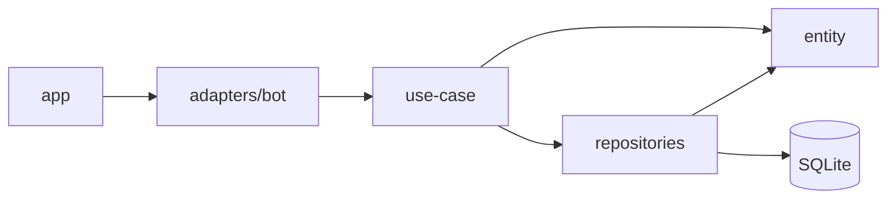

# MAX Bot

Бот для мессенджера [MAX](https://max.ru) на TypeScript. Запоминает пользователей в SQLite, отвечает на команды, а администратору даёт список пользователей, выгрузку ID и фоновую рассылку.

Проект разложен по слоям (`entity → use-case → repositories`), поэтому бизнес-логика ничего не знает ни про MAX, ни про SQL, и её можно менять и проверять отдельно.

## Возможности

| Команда | Кому доступна | Что делает |
| --- | --- | --- |
| `/start` | всем | Сохраняет пользователя и присылает приветствие |
| `/help` | всем | Список команд (администратору показываются и админские) |
| `/allusers` | админу | Количество пользователей и список: id и username |
| `/ids` | админу | Присылает файл `ids.txt` с id всех пользователей |
| `/notify Текст` | админу | Фоновая рассылка текста всем пользователям |

Дополнительно:

- при первом открытии диалога с ботом (`bot_started`) пользователь сохраняется так же, как по `/start`;
- на обычное сообщение бот отвечает эхом;
- админские команды от обычных пользователей молча игнорируются.

## Быстрый старт

Нужны Node.js (проект проверен на 24.15.0), npm и токен бота, полученный при его регистрации в MAX.

```bash
npm install
```

Создайте `.env` по образцу `.env.example` и впишите токен:

```env
BOT_TOKEN=токен_бота
DB_PATH=./data/bot.db
ADMIN_ID=123456789
NOTIFY_DELAY_MS=100
```

Запуск:

```bash
npm run dev
```

В консоли появятся строки «Админ назначен: …» и «Запускаю бота…», после этого бот ждёт сообщений. Остановка: `Ctrl+C`.

### Настройки

| Переменная | Обязательна | По умолчанию | Описание |
| --- | --- | --- | --- |
| `BOT_TOKEN` | да | — | Токен бота |
| `DB_PATH` | нет | `./data/bot.db` | Путь к файлу SQLite (папка создаётся сама) |
| `ADMIN_ID` | нет | — | MAX user_id первого администратора |
| `NOTIFY_DELAY_MS` | нет | `100` | Пауза между сообщениями рассылки, мс |

Все переменные проверяются через Zod при старте. Если что-то не так, бот выведет ошибку по полям и завершится.

### Скрипты

| Команда | Что делает |
| --- | --- |
| `npm run dev` | Запуск из TypeScript через `tsx` |
| `npm run build` | Компиляция в `dist/` |
| `npm start` | Запуск собранной версии (`dist/app/index.js`) |

## Сертификаты

Сервер MAX использует сертификат российского удостоверяющего центра, которого нет в списке доверенных у Node.js. Без него запуск заканчивается ошибкой `UNABLE_TO_GET_ISSUER_CERT_LOCALLY`.

В папке `certs/` лежит набор сертификатов `russian-ca-bundle.pem`. Скрипты `dev` и `start` подключают его через переменную `NODE_EXTRA_CA_CERTS` (в `package.json` для этого используется `cross-env`, чтобы это работало и на Windows). Отдельно ничего настраивать не нужно.

Не отключайте проверку TLS (`NODE_TLS_REJECT_UNAUTHORIZED=0`): это уберёт защиту соединения, по которому уходит токен бота.

## Администратор

- Пользователь с id из `ADMIN_ID` получает роль `admin` при каждом запуске бота. Писать боту заранее не обязательно.
- Роль хранится в поле `options` пользователя в базе, все админские команды проверяют именно её.
- Дополнительных администраторов пока можно назначить только напрямую в базе. Команда для этого (`cli/set-admin`) в планах.

## Рассылка

`/notify Текст рассылки` отправляет текст всем пользователям из базы:

- рассылка идёт в фоне: бот сразу отвечает «Запускаю рассылку…» и не блокируется;
- между сообщениями делается пауза `NOTIFY_DELAY_MS`, значение стоит подобрать под лимиты MAX API;
- одновременно может идти только одна рассылка;
- недоставленные сообщения не прерывают рассылку, ошибки пишутся в консоль;
- в конце администратор получает итог: сколько доставлено и сколько с ошибкой.

Сейчас рассылается только текст, без вложений и форматирования.

## Архитектура

```
src/
├── entity/              # типы: User; реэкспорт Bot и Context из библиотеки
├── use-case/            # бизнес-логика: start, set-admin, check-admin, get-all-users
├── repositories/        # весь SQL (better-sqlite3): user.repository
├── infrastructure/
│   ├── config/          # чтение и проверка .env (Zod)
│   └── db/              # подключение SQLite, WAL, схема таблицы
├── adapters/bot/        # единственное место, где используется @maxhub/max-bot-api
│   ├── commands/        # /start, /help, /allusers, /ids, /notify, проверка админа
│   ├── handlers/        # bot_started, обработчик обычных сообщений
│   ├── deps.ts          # набор зависимостей бота
│   ├── messages.ts      # тексты ответов
│   └── index.ts         # InitBot: создание бота и регистрация всего
└── app/index.ts         # точка входа: сборка зависимостей, запуск, остановка
```

Зависимости направлены только внутрь:



- `entity` не импортирует ничего из других слоёв;
- `use-case` принимает простые данные и не знает про `Context` и SQL;
- `repositories` содержит весь SQL и возвращает типы из `entity`;
- `adapters/bot` переводит события MAX в вызовы use-case;
- данные из внешних источников (env, JSON из БД) проверяются через Zod.

Зависимости пока собираются вручную в `app/index.ts`. DI-контейнер (`di/`) и CLI-команды (`cli/`) запланированы.

### Работа приложения

- при старте создаётся база, назначается администратор и запускается бот;
- запуск делает до трёх попыток с паузой 3 секунды;
- по `SIGINT` и `SIGTERM` бот останавливает получение обновлений и закрывает базу.

### Данные

Таблица `users`:

| Поле | Тип | Описание |
| --- | --- | --- |
| `id` | INTEGER | user_id в MAX (первичный ключ) |
| `username` | TEXT | username или `NULL` |
| `options` | TEXT | JSON с настройками, сейчас только `role` |
| `created_at`, `updated_at` | INTEGER | время в миллисекундах |

## Стек

TypeScript (strict, CommonJS), [@maxhub/max-bot-api](https://github.com/max-messenger/max-bot-api-client-ts), better-sqlite3, Zod, dotenv, tsx, cross-env.

## Лицензия

См. файл [LICENSE](LICENSE).
